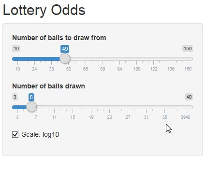

<style>

body {
  font-size: 24px;
  color: #ffffff
}

.reveal h1 {
    font-size: 36px;
    text-shadow: none;
    color: #ffffff;
    text-align: left;
    font-family: Arial, sans-serif;
}

.reveal h2 {
    font-size: 30px;
    color: #ffffff;
    text-align: left;
    font-family: Arial, sans-serif;
}

.reveal p {
    font-size: 24px;
    color: #ffffff;
    text-align: left;
    padding-bottom: 15px;
    font-family: Arial, sans-serif;
}

.reveal table td {
  vertical-align: top;
  padding: 20px;
  font-size: 24px;
}

.reveal table th {
  vertical-align: top;
  padding: 20px;
  font-size: 24px;
}

</style>

# Lottery Odds

Dynamic calculation of chances in different lotteries

Tim Schaub

as of 21-Jan-2018

--- .class #id 

## Motivation

To understand different aspects of several numerical lotteries around the world, it might be helpful to have a tool to calculate odds for the different constellations of lotteries (like e.g. 5 from 65 or 6 from 49).


In general the tool calculates 1:n odds starting with 3 hits which is the first winning number of hits in most lotteries.


The tool can be found on [here](https://timschaub.shinyapps.io/lottery/).

---

## Usage
<TABLE>
  <TR>
    <TD width=448px>
      
    </TD>
    <TD>
      The tool reacts on the change of the controls on the left hand side. The slider control on the top gives the numbers of balls in the ballot to draw from. The second slider controls how many balls from the total number are drawn to get the winning numbers. <BR> 
      Last not least the "Scale: log10" checkbox controls if the 1:n ratios are shown as calculated or in a 1:log10(n) scale.
    </TD>
  </TR>
</TABLE>


---

## Theory


The tool uses the binomial coefficients and their differences when calculating the probabilities of k numbers hit out of d drawn numbers in n total balls it calculates: 


\[P(k) = \frac{\binom{d}{k}*\binom{n-d}{n-k}}{\binom{n}{d}}\] 


This is repeated for all k between 3 and d. The final caclulation changes the probabilities to rations by computing    $1/P(k)$. 


In case the above formulas does not show, please right click on one of them, choose Math settings -> Math renderer -> SVG.

---

## Charting

See the following example of the background calculation for n=49, d=6, k=3,4,5,6 and log10 scaling:

```{r example}
    i <- c(3:6)   
    j <- (choose(6, i) * choose(49-6, 6-i))/choose(49, 6)
    j <- log10(1/j)
    par(mar=c(12,6,0,0))
    barplot(j, xlab="Hits", ylab="Win Odds (log)", names.arg=c(3,4,5,6))
```
